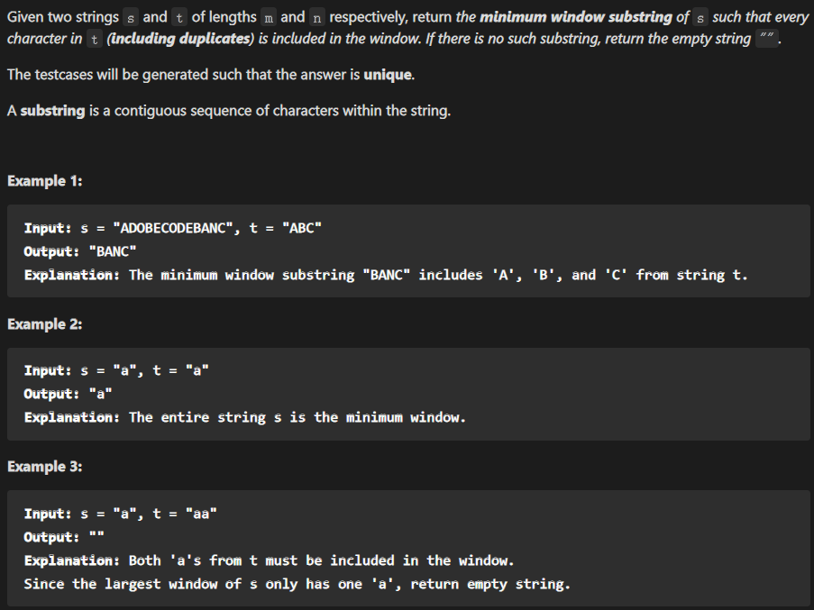
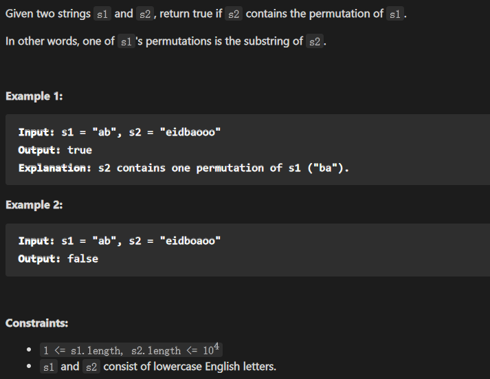
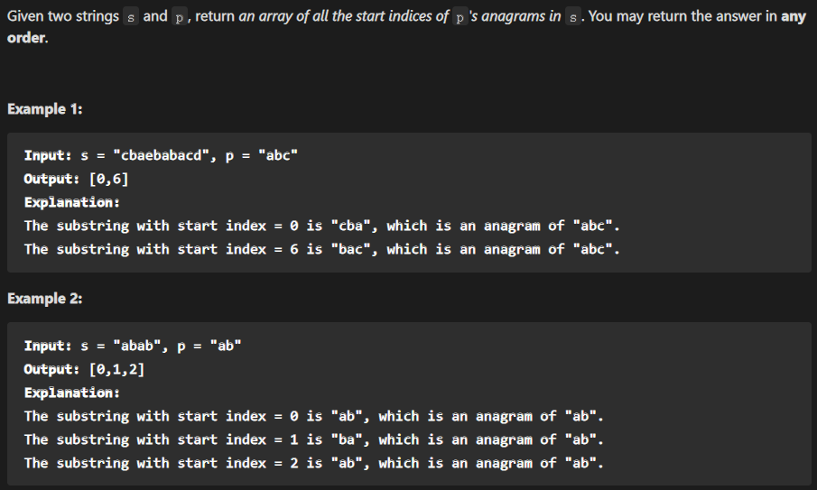
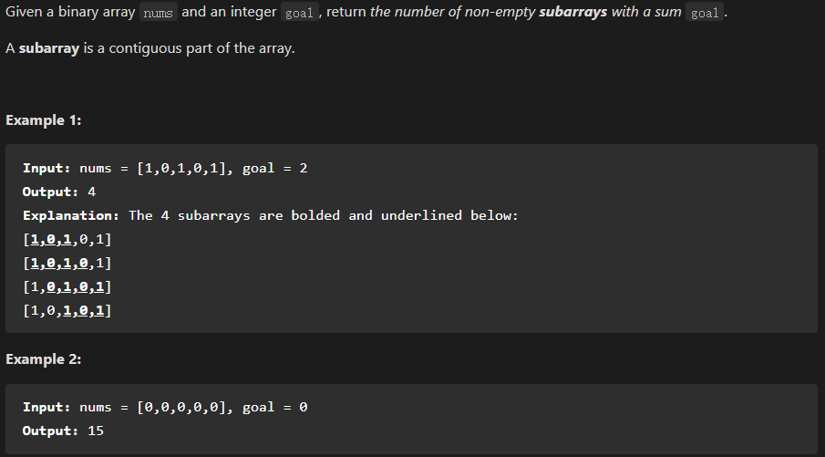
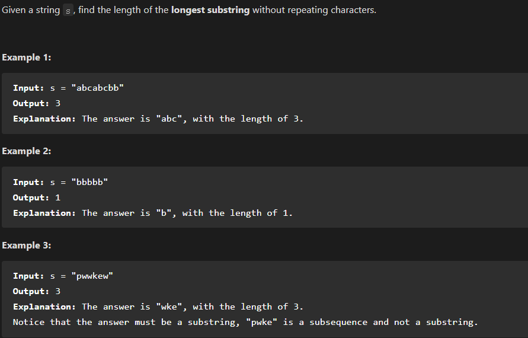

- [Slide Window](#slide-window)
  * [Aim:](#aim-)
  * [Thoughts](#thoughts)
  * [Framework](#framework)
  * [Example](#example)
    + [1. Minimum Window Substring](#1-minimum-window-substring)
    + [2.Permutation in String](#2permutation-in-string)
    + [3. Find All Anagrams in a String](#3-find-all-anagrams-in-a-string)
    + [4. Binary Subarrays With Sum](#4-binary-subarrays-with-sum)
    + [5.  Longest Substring Without Repeating Characters](#5--longest-substring-without-repeating-characters)

# Slide Window


## Aim:

解决字串问题

## Thoughts

1、我们在字符串`S`中使用双指针中的左右指针技巧，初始化`left = right = 0`，**把索引左闭右开区间`[left, right)`称为一个「窗口」**。

2、我们先不断地增加`right`指针扩大窗口`[left, right)`，直到窗口中的字符串符合要求（包含了`T`中的所有字符）。

3、此时，我们停止增加`right`，转而不断增加`left`指针缩小窗口`[left, right)`，直到窗口中的字符串不再符合要求（不包含`T`中的所有字符了）。同时，每次增加`left`，我们都要更新一轮结果。

4、重复第 2 和第 3 步，直到`right`到达字符串`S`的尽头。

## Framework

```js
/* 滑动窗口算法框架 */
function slidingWindow(s, t) {
    const need = {}, window = {}
    for(let c of t) need[c]++;

    let left = 0, right = 0;
    let valid = 0; 
    while (right < s.size) {
        // c 是将移入窗口的字符
        const c = s[right];
        // 右移窗口
        right++;
        // 进行窗口内数据的一系列更新
        ...

        /*** debug 输出的位置 ***/
        console.log("window: [%d, %d)\n", left, right);
        /********************/

        // 判断左侧窗口是否要收缩
        while (window needs shrink) {
            // d 是将移出窗口的字符
            const d = s[left];
            // 左移窗口
            left++;
            // 进行窗口内数据的一系列更新
            ...
        }
    }
}
```

## Example

### 1. Minimum Window Substring

Link: [76. 最小覆盖子串](https://leetcode-cn.com/problems/minimum-window-substring/)



```js
var minWindow = function(s, t) {
    const need = new Map(), window = new Map();
    for(let i of t) {
        window.set(i, 0);
        if(need.has(i)) need.set(i, need.get(i) + 1);
        else need.set(i, 1);
    }
    let left = 0, right = 0, start = 0, maxLen = Infinity, valid = 0;
    while(right < s.length) {
        const c = s[right];
        right++;
        if(need.has(c)) {
            window.set(c, window.get(c) + 1);
            if(window.get(c) === need.get(c)) valid++;
        }
        while(valid === need.size) {
            if(right - left < maxLen) {
                start = left;
                maxLen = right - left;
            }
            const d = s[left];
            left++;
            if(need.has(d)) {
                if(need.get(d) === window.get(d)) valid--;
                window.set(d, window.get(d)-1);
            }
        }
    }
    return maxLen === Infinity ? '' : s.substring(start, start+maxLen);
};
```

### 2.Permutation in String

Link: [567. 字符串的排列](https://leetcode-cn.com/problems/permutation-in-string/)



```js
var checkInclusion = function(s1, s2) {
    const need = new Map(), window = new Map();
    for(let s of s1) {
        window.set(s, 0);
        if(need.has(s)) need.set(s, need.get(s)+1);
        else need.set(s, 1);
    }
    let left = 0, right = 0, valid = 0;
    const n2 = s2.length, n1 = s1.length;
    while(right < n2) {
        const c = s2[right];
        right++;
        if(need.has(c)) {
            window.set(c, window.get(c)+1);
            if(window.get(c) === need.get(c)) valid++;
        }
        while(valid === need.size) {
            if(right - left === n1) return true;
            const d = s2[left];
            left++;
            if(window.has(d)) {
                if(window.get(d) === need.get(d)) valid--;
                window.set(d, window.get(d) - 1);
            }
        }
    }
    return false
};
```

### 3. Find All Anagrams in a String

Link: [438. 找到字符串中所有字母异位词](https://leetcode-cn.com/problems/find-all-anagrams-in-a-string/)



```js
var findAnagrams = function(s, p) {
    const n = p.length;
    const need = new Map(), window = new Map();
    for(let i of p) {
        window.set(i, 0);
        if(need.has(i)) need.set(i, need.get(i)+1);
        else need.set(i, 1);
    }
    let left = 0, right = 0, valid = 0;
    const res = [];
    while(right < s.length) {
        const c = s[right];
        right++;
        if(need.has(c)) {
            window.set(c, window.get(c)+1);
            if(window.get(c) === need.get(c)) valid++;
        }
        if(right - left >= n) {
            if(valid === need.size) res.push(left);
            const d = s[left];
            left++;
            if(window.has(d)) {
                if(window.get(d) === need.get(d)) valid--;
                window.set(d, window.get(d)-1);
            }
        }
    }
    return res;
};
```

### 4. Binary Subarrays With Sum

[930. Binary Subarrays With Sum](https://leetcode-cn.com/problems/binary-subarrays-with-sum/)



```js
var numSubarraysWithSum = function(nums, goal) {
    const n = nums.length;
    let left = 0, right = 0, temp = 0, res = 0;
    while(right < n) {
        const c = nums[right];
        right++;
        temp += c;
        while(temp > goal) {
            const d = nums[left]
            left++;
            temp -= d;
        }
        if(temp === goal) {
            let templeft = left, tempSum = temp;
            while(templeft < right && tempSum === temp) {
                tempSum -= nums[templeft];
                templeft++;
                res++
            }
        }
    }
    return res
};
```

### 5.  Longest Substring Without Repeating Characters

[3. Longest Substring Without Repeating Characters](https://leetcode-cn.com/problems/longest-substring-without-repeating-characters/)



```js
var lengthOfLongestSubstring = function(s) {
    const window = new Map();
    let left = 0, right = 0, maxLen = 0;
    const n = s.length;
    while(right < n) {
        const c = s[right];
        right++;
        while(window.has(c) && window.get(c) !== 0) {
            const d = s[left];
            left++;
            window.set(d, window.get(d) - 1);
        }
        if(!window.has(c) || window.get(c) === 0) window.set(c, 1);
        maxLen = Math.max(maxLen, right - left);
    }
    return maxLen
};
```